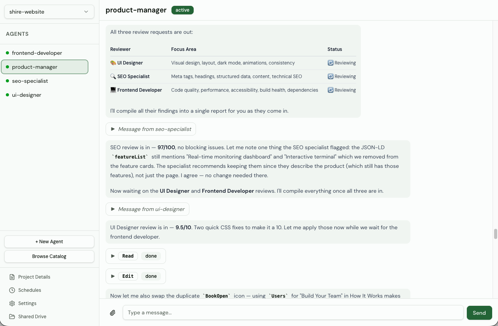
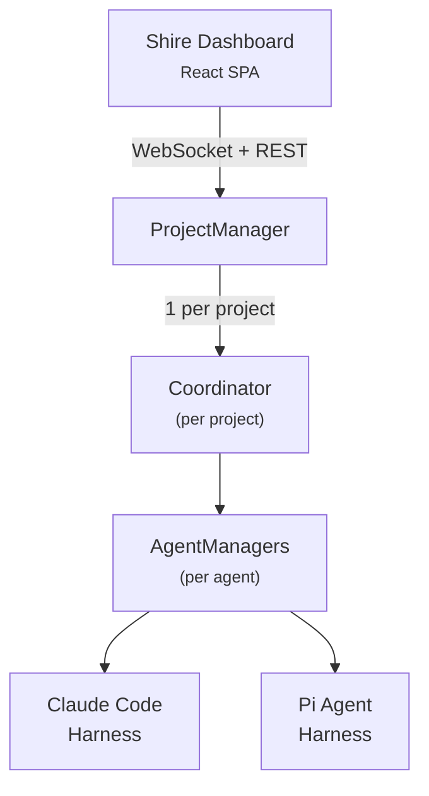

# Shire

**Agents that work with you, not for you.**

[agents-shire.sh](https://www.agents-shire.sh/)

Shire gives you a team of AI agents you actually work alongside — they persist, communicate, and pick up where they left off. Agents are stored in the database and configured through the dashboard. Open source.



## See it in action

https://github.com/user-attachments/assets/04056f61-d2e7-4eb8-b0e4-48a342b298d3

---

## Why Shire?

Most AI agent tools follow the same pattern — you give an instruction, an agent executes it, you get the output. The agent disappears. Next time, you start from scratch. Shire is different. Your agents persist between sessions. They communicate with each other autonomously. They build on yesterday's work. You give feedback, iterate, adjust direction — like working with a real team.

- **Zero-config local setup** — Get started in seconds with Bun. No VMs, no containers, no external services. Agents run as local processes.
- **Works with any model** — Not locked to one AI provider. Supports Claude Code, Pi Agent, and more coming soon. Shire is the infrastructure layer — bring whatever model fits your workflow.
- **Autonomous agent communication** — Agents discover peers and collaborate on their own — no orchestrator required. Direct messaging, shared context, real teamwork between agents.
- **Community catalog** — Browse and deploy from a community-maintained library of pre-built agent templates. Powered by [agency-agents](https://github.com/msitarzewski/agency-agents). Get a capable team running in seconds.
- **Shared drive** — A communal filesystem across all agents for collaborative work on shared artifacts.
- **Scheduled tasks** — Automate agent work with one-time or recurring scheduled messages. Set custom intervals and let agents run on autopilot.
- **Multi-project architecture** — Organize agents into projects, each with its own shared drive, settings, and environment.
- **Real-time dashboard** — Monitor, chat with, and manage agents from a live web UI with streaming updates.

## Architecture



Each project has an isolated workspace on disk:

```
~/.shire/
├── shire.db                        # SQLite database
└── projects/{projectId}/
    ├── agents/{agentId}/
    │   ├── inbox/                  # Incoming inter-agent messages
    │   ├── outbox/                 # Outgoing inter-agent messages
    │   └── attachments/            # File attachments
    ├── shared/                     # Cross-agent shared drive
    ├── peers.yaml                  # Agent discovery registry
    └── PROJECT.md                  # Project documentation
```

## Tech Stack

| Layer | Technology |
|-------|-----------|
| Runtime | [Bun](https://bun.sh) |
| Backend | Hono, Drizzle ORM, SQLite |
| Frontend | React 19, React Router 7, shadcn/ui (Radix), Tailwind CSS 4, TanStack Query |
| Bundler | Bun (fullstack dev server + production builds) |
| Agent Harnesses | Claude Code SDK, Pi Agent SDK |
| Scheduling | node-schedule (cron-based) |
| Testing | Bun test + Testing Library + happy-dom |
| Validation | Zod, TypeScript strict mode |

## Getting Started

### Prerequisites

- [Bun](https://bun.sh) (v1.3.11+)
- [Claude Code](https://claude.ai/download) (only if using the `claude_code` harness)

### Quick Start

```bash
git clone https://github.com/victor36max/shire.git && cd shire
bun install
bun run dev
```

Visit [localhost:8080](http://localhost:8080) to open the dashboard.

By default, Shire uses **SQLite** for storage. Agents run as local processes on your machine — no external services required. All data is stored at `~/.shire/`.

Agent-specific environment variables (API keys, tokens, etc.) are configured per-project via the Settings page in the dashboard.

---

<details>
<summary><strong>Environment Variables</strong></summary>

| Variable | Default | Description |
|----------|---------|-------------|
| `PORT` | `8080` | HTTP server port |
| `NODE_ENV` | — | Set to `production` for production mode |
| `SHIRE_DATA_DIR` | `~/.shire` | Database and data storage root |
| `SHIRE_PROJECTS_DIR` | `~/.shire/projects` | Project workspace root |
| `ALLOWED_ORIGINS` | — | Comma-separated CORS origins (production) |

</details>

## Development

```bash
# Run dev server (backend + frontend with HMR)
bun run dev

# Run with custom port
bun run dev -- --port 3000

# Testing
bun test                 # All tests (backend + frontend)

# Quality
bun run lint             # ESLint
bun run lint:fix         # ESLint autofix
bun run format           # Prettier write
bun run format:check     # Prettier check
bun run typecheck        # TypeScript check

# Database
bun run db:generate      # Generate Drizzle migrations from schema
bun run db:migrate       # Apply migrations
bun run db:studio        # Open Drizzle Studio

# Catalog
bun run catalog:sync     # Sync agent catalog from community repo
```

## Building & Publishing

Shire is distributed as standalone binaries via npm — no runtime dependencies needed.

### Build locally

```bash
# Build binary for your current platform
bun run build:local

# Build binaries for all platforms
bun run build:all
```

This compiles the backend into a standalone binary and pre-builds the frontend assets alongside it.

### CLI Usage

```bash
shire                    # Start server on port 8080
shire start --port 3000  # Start on custom port
shire start --daemon     # Run in background
shire stop               # Stop background server
shire status             # Check if server is running
shire --help             # Show help
```

### Publishing to npm

Publishing is automated via GitHub Actions. Tag a release to trigger the workflow:

```bash
git tag v0.2.0
git push origin v0.2.0
```

This builds platform-specific binaries and publishes:
- `@shire/cli-darwin-arm64` (macOS Apple Silicon)
- `@shire/cli-darwin-x64` (macOS Intel)
- `@shire/cli-linux-x64` (Linux x64)
- `@shire/cli-linux-arm64` (Linux ARM)
- `@shire/cli-win32-x64` (Windows x64)
- `shire` (meta-package that installs the right binary)

Users install with:

```bash
npm install -g shire
shire
```

## License

[Business Source License 1.1](LICENSE) — free for non-production use. Converts to Apache 2.0 on 2030-03-24.
